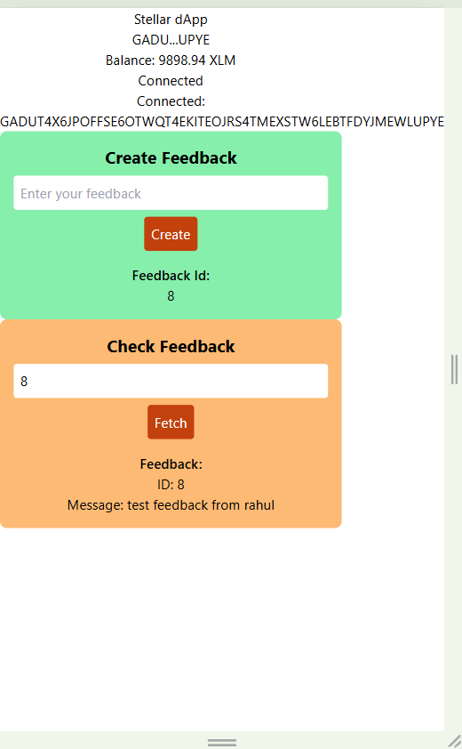
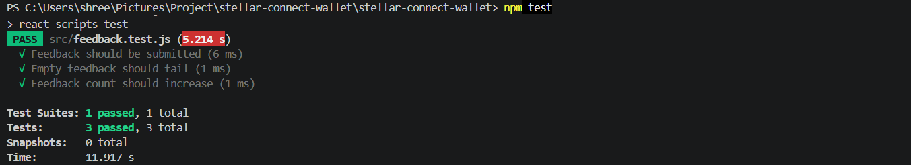

# 🚀 Stellar Connect Wallet Mini dApp

## 🔗 Live Demo

https://stellar-connect-wallet-l4vw.vercel.app

---

## 🎥 Demo Video

This demo shows wallet connection, feedback submission, and on-chain interaction on Stellar.

https://youtu.be/5wjd01jvn_A

---

## 📌 Description

This is a complete **end-to-end Stellar Mini dApp** built on the **Stellar Testnet** using Freighter Wallet.

The application allows users to:

* Connect their wallet
* Send XLM transactions
* Interact with deployed smart contracts
* Store and fetch anonymous feedback on-chain

This project demonstrates full-stack Web3 development including frontend, smart contract, testing, deployment, and advanced contract interactions.

---

## 🎯 Core Focus

This project primarily focuses on building an **Anonymous Feedback dApp** on the Stellar blockchain.

Advanced features like token rewards and inter-contract calls are implemented as additional enhancements.

---

## 🚀 Production Readiness

* CI/CD pipeline implemented using GitHub Actions
* Error handling for failed transactions
* Mobile responsive UI
* Optimized contract interactions
* Clean and scalable project structure

---

## 🔄 How It Works

1. User connects Freighter wallet
2. User submits anonymous feedback
3. Feedback is stored on Stellar blockchain
4. Feedback is fetched and displayed in the UI
5. User receives token reward via smart contract

---

## 🟢 Features

### Level 1

* Connect Freighter Wallet
* Disconnect Wallet
* Display XLM Balance
* Send XLM
* Transaction Status

### Level 2

* Smart Contract Integration
* Send Feedback to Blockchain
* Fetch Feedback from Blockchain
* Transaction Tracking

### Level 3

* Loading states (UI feedback)
* Error handling
* Fully deployed app
* Clean UI

### Level 4 (Advanced Features)

* Inter-contract call
* Custom Token Contract
* Cross-contract interaction
* Production-ready contracts

---

## 🧠 Smart Contracts

### 📌 Feedback Contract

**Address:**
CBXTSVTRCTXSJYYTGGV6G5R3F4EI73B3QW3SZ2MAZXMFEW445VQW7MOJ

### 📌 Token Contract

**Address:**
CCUNRZQPLTIPELMXVCIMDLZP3B4RLXJCGB3NPWHDUNFJNVATKAGIRPAJ

### 📌 Caller Contract

**Address:**
CCRR3NARGJ6UYRKW7N42KVN6KL6VXEHXA7AHYMB7URS7T7FIE35XCLJC

---

## 🔗 Transaction Proof

https://stellar.expert/explorer/testnet/tx/f498be49a48fd79f2fe7f4ff6a53ec09df5f911ed631ae34f2e18bde448c480c

---

## 👥 Testnet Users

The following users tested the application:

1. GCTTFOWRDZ6NSNKIHLPJYTDW3I2PLY25HPG5KBSG7F4IXLIXA7QD5TEP
2. GCLACDLBPPYGIPAAGXGMMLUQTOFS2XVEOR763NUBYMYIC2RRAOPRADNJ
3. GCFL72LTYYVA7HTEC2NYT3AKHYS5CUG5LG26Z5LB667QRDAOFDILH6E7
4. GAD4RU2SEIQWXKKYYCPTAOT66BVWHJGIS2GI2CMMX327BYFDYZUBOXIM
5. GALGHBSNXLWND3FI2QKHEMVYVOCMVGJMDR6GTOWPYXMOCXRKRO5TYK53

---

## 📊 User Feedback Data

Google Form responses (Excel):

https://docs.google.com/spreadsheets/d/1CEDVG9Mgv230Es2UmEXVUyZG3aYXmaSbkp8ATkloMp8/edit?usp=sharing

---

## 🧠 Feedback Analysis

* Users successfully connected wallet and submitted feedback
* Application is simple and easy to use
* Minor improvements suggested in UI responsiveness and loading experience

---

## 🚀 Improvements Implemented

* Improved loading states
* Enhanced UI responsiveness
* Better feedback submission handling

Commit history:
https://github.com/RAHULRaa123/stellar-connect-wallet/commits/main

---

## 📸 Screenshots




---

## ⚡ Performance

* Loading states
* Error handling
* Basic caching

---

## 🧪 Tests

* Feedback submission works
* Empty feedback rejected
* Feedback count verified



---

## ⚙️ Installation

```bash
git clone https://github.com/RAHULRaa123/stellar-connect-wallet.git
cd stellar-connect-wallet
npm install
npm start
```

---

## ⚙️ CI/CD


---

## 👨‍💻 Author

Rahul Saini

---

## ✅ Result

```
FINAL SUCCESS
```
