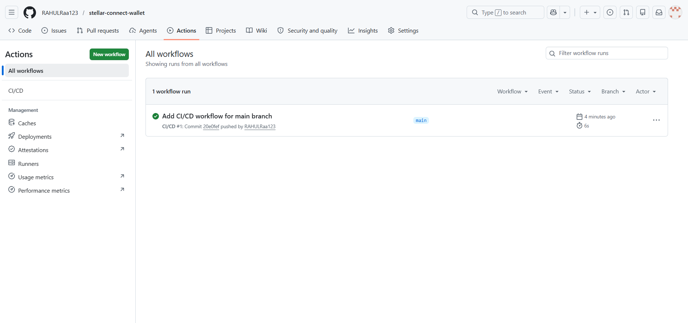

# 🚀 Stellar Connect Wallet Mini dApp

## 🔗 Live Demo

https://stellar-connect-wallet-l4vw.vercel.app

---

## 🎥 Demo Video

This demo shows wallet connection, feedback submission, and on-chain interaction on Stellar.

https://youtu.be/5wjd01jvn_A

---

## 📌 Description

This is a complete **end-to-end Stellar Mini dApp** built on the **Stellar Testnet** using Freighter Wallet.

The application allows users to:

* Connect their wallet
* Send XLM transactions
* Interact with deployed smart contracts
* Store and fetch anonymous feedback on-chain

This project demonstrates full-stack Web3 development including frontend, smart contract, testing, deployment, and advanced contract interactions.

---

## 🎯 Core Focus

This project primarily focuses on building an **Anonymous Feedback dApp** on the Stellar blockchain.

Advanced features like token rewards and inter-contract calls are implemented as additional enhancements to showcase deeper understanding of smart contracts.

---

## 🔄 How It Works

1. User connects Freighter wallet
2. User submits anonymous feedback
3. Feedback is stored on Stellar blockchain
4. Feedback is fetched and displayed in the UI
5. (Optional) User receives token reward via smart contract

---

## 🟢 Features

### Level 1

* Connect Freighter Wallet
* Disconnect Wallet
* Display XLM Balance
* Send XLM
* Transaction Status

### Level 2

* Smart Contract Integration
* Send Feedback to Blockchain
* Fetch Feedback from Blockchain
* Transaction Tracking

### Level 3

* Loading states (UI feedback)
* Error handling
* Fully deployed app (Vercel)
* Clean UI

### 🟢 Level 4 (Advanced Features)

* Inter-contract call (Caller → Feedback Contract)
* Custom Token Contract (Mint + Balance)
* On-chain interaction between multiple contracts
* Production-ready contract structure

---

## 🧠 Smart Contracts

### 📌 Feedback Contract

**Contract Address:**
CBXTSVTRCTXSJYYTGGV6G5R3F4EI73B3QW3SZ2MAZXMFEW445VQW7MOJ

**Functions**

* `send_feedback`
* `fetch_feedback`

---

### 📌 Token Contract

**Contract Address:**
CCUNRZQPLTIPELMXVCIMDLZP3B4RLXJCGB3NPWHDUNFJNVATKAGIRPAJ

**Functions**

* `mint`
* `balance`

---

### 📌 Caller Contract (Inter-Contract)

**Contract Address:**
CCRR3NARGJ6UYRKW7N42KVN6KL6VXEHXA7AHYMB7URS7T7FIE35XCLJC

**Function**

* `send_feedback_and_reward`
  → Calls `send_feedback` in Feedback Contract

---

## 🔄 Inter-Contract Interaction

The Caller Contract interacts with the Feedback Contract by invoking the `send_feedback` function.

It also integrates with the Token Contract to reward users after submitting feedback.

This demonstrates cross-contract communication on Stellar Soroban.

---

## 🔗 Level 4 Transaction Proof

**Transaction Hash:**
f498be49a48fd79f2fe7f4ff6a53ec09df5f911ed631ae34f2e18bde448c480c

🔗 Explorer:
https://stellar.expert/explorer/testnet/tx/f498be49a48fd79f2fe7f4ff6a53ec09df5f911ed631ae34f2e18bde448c480c

---

## 📸 Screenshots

### ✅ Inter-contract call success


### ✅ Fetch feedback from blockchain


### 📱 Mobile Responsive


---

## ⚡ Performance & UX Improvements

* Loading states added for better user experience
* Error handling implemented
* Basic caching used to reduce repeated blockchain calls

---

## 🧪 Tests

### ✅ Test Cases

* Feedback submission works
* Empty feedback is rejected
* Feedback count works

### 📸 Test Output


All tests are passing successfully.

---

## ⚙️ Installation

```bash
git clone https://github.com/RAHULRaa123/stellar-connect-wallet.git
cd stellar-connect-wallet
npm install
npm start
```

---

## ⚙️ CI/CD Pipeline

This project includes a **GitHub Actions CI/CD pipeline** that automatically runs on every push to the main branch.

### ✅ Features:

* Automatic workflow execution
* Continuous Integration setup
* Ensures project consistency



---

## 👨‍💻 Author

Rahul Saini

---

## ✅ Result

Successfully executed inter-contract call, minted tokens, and stored data on-chain:

```bash
2
"FINAL SUCCESS"
```
