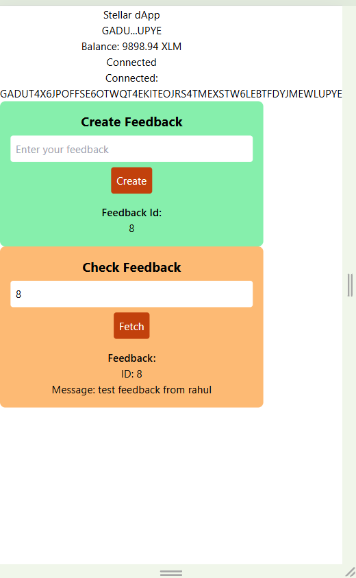
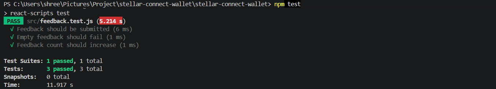

# 🚀 Stellar Trust Network

## 🔗 Live Demo

[Live App](https://stellar-connect-wallet-k4zm.vercel.app)

---

## 🎥 Demo Video

[Watch Demo Video](https://youtu.be/5wjd01jvn_A)

---

## 📌 Description

Stellar Trust Network is a decentralized business reputation, verification and escrow platform built on the Stellar Network.

The platform helps businesses establish trust by enabling them to:

- Register their business
- Build a verified business profile
- Collect customer reviews
- Generate reputation scores
- Secure transactions using escrow workflows
- Explore trusted businesses through a business directory

The project combines blockchain transparency with business trust to create a scalable ecosystem for merchants and customers.

---

## 🌐 Product Overview

Stellar Trust Network is building a decentralized trust layer for businesses on the Stellar ecosystem.

The platform enables businesses to create verified profiles, collect customer reviews, build reputation scores, and perform transparent transactions using blockchain technology.

### Core Platform Modules

- 🏢 Business Identity & Verification
- ⭐ Reputation and Review System
- 🔐 Escrow-based Transaction Workflow
- 📊 Business Analytics
- 🤝 Customer Trust Network
- 💎 Reward and Incentive System

The goal is to create a reliable business discovery and transaction ecosystem where trust is verifiable, transparent, and decentralized.

---

## 🎯 Core Focus

Building a decentralized trust infrastructure for businesses using Stellar. The platform combines business verification, customer reputation, escrow payments and analytics into one scalable ecosystem.

---

## 🔌 Smart Contract Integration (Frontend Calls)

* send_feedback → Stores feedback on-chain
* fetch_feedback → Retrieves feedback
* send_feedback_and_reward → Inter-contract call for reward

---

## 🏗️ Architecture Document

- Frontend: React  
- Blockchain: Stellar Testnet  
- Smart Contracts: Soroban  
- Wallet: Freighter  
- Deployment: Vercel  

Flow:  
User → React UI → Freighter → Smart Contract → Blockchain → UI

---

## 🔄 How It Works

1. User connects Freighter wallet
2. User submits feedback
3. Feedback stored on blockchain
4. Feedback fetched & displayed
5. Token reward sent

---

## 🟢 Features

### Level 1

* Wallet Connect / Disconnect
* Display Balance
* Send XLM

### Level 2

* Smart contract integration
* Feedback storage
* Fetch feedback

### Level 3

* Loading states
* Error handling
* Full UI flow

### Level 4

* Inter-contract calls
* Token reward system
* Production-ready contracts

### Business Platform

- Business Registration
- Business Profile Management
- Customer Reviews
- Reputation Score
- Business Verification
- Trust Badge
- Business Directory
- Analytics Dashboard
- Reward Center
- Transaction History
- Escrow Payment Workflow
- Agent Discovery
- Settlement Reliability
- Liquidity Forecast

---

## 👥 Testnet Users (Validated)

The following real users tested the application:

1. GCTTFOWRDZ6NSNKIHLPJYTDW3I2PLY25HPG5KBSG7F4IXLIXA7QD5TEP
2. GCLACDLBPPYGIPAAGXGMMLUQTOFS2XVEOR763NUBYMYIC2RRAOPRADNJ
3. GCFL72LTYYVA7HTEC2NYT3AKHYS5CUG5LG26Z5LB667QRDAOFDILH6E7
4. GAD4RU2SEIQWXKKYYCPTAOT66BVWHJGIS2GI2CMMX327BYFDYZUBOXIM
5. GALGHBSNXLWND3FI2QKHEMVYVOCMVGJMDR6GTOWPYXMOCXRKRO5TYK53

### 🧪 How Users Tested

Each user:

* Connected wallet
* Submitted feedback
* Verified transaction on blockchain
* Checked feedback retrieval

---

## 📊 User Feedback Data

[View Google Sheet (Excel Export)](https://docs.google.com/spreadsheets/d/1CEDVG9Mgv230Es2UmEXVUyZG3aYXmaSbkp8ATkloMp8/edit?usp=sharing)

---

## 🧠 Feedback Analysis

* Users found app easy to use
* Feedback submission working correctly
* Minor UI/UX improvements suggested

---

## 🔄 Iteration (IMPORTANT)

### 🧾 User Feedback

* UI slow during submission
* Loading unclear
* Mobile UI needs improvement

### 🚀 Improvements Implemented

* Added loading states
* Improved responsiveness
* Enhanced UX

### 🔗 Commit Proof

https://github.com/RAHULRaa123/stellar-feedback-dapp/commit/19607a8e6fdb5f002fdb701d0b6c2cdec7fd08c0

---

## 🧠 Smart Contracts

### Feedback Contract

CBXTSVTRCTXSJYYTGGV6G5R3F4EI73B3QW3SZ2MAZXMFEW445VQW7MOJ

### Token Contract

CCUNRZQPLTIPELMXVCIMDLZP3B4RLXJCGB3NPWHDUNFJNVATKAGIRPAJ

### Caller Contract

CCRR3NARGJ6UYRKW7N42KVN6KL6VXEHXA7AHYMB7URS7T7FIE35XCLJC

---

## 🔗 Transaction Proof

https://stellar.expert/explorer/testnet/tx/f498be49a48fd79f2fe7f4ff6a53ec09df5f911ed631ae34f2e18bde448c480c

---

## 📸 Product Screenshots

### 🔗 Smart Contract Interaction

Shows successful interaction between frontend and Soroban smart contracts.

---

### 📥 Feedback Retrieval

Displays fetching of blockchain-stored feedback data.

---

### 📱 Mobile Responsive View

Demonstrates the responsive user experience on mobile devices.

---

## ⚡ Performance

* Loading states
* Error handling
* Optimized contract calls

---

## 🧪 Tests

* Feedback submission ✔
* Empty feedback validation ✔
* Feedback count ✔
* Smart contract call ✔

All tests passing ✅

---

## ⚙️ CI/CD Pipeline

* GitHub Actions integrated
* Auto build + test
* Auto deploy via Vercel

GitHub Actions:
https://github.com/RAHULRaa123/stellar-feedback-dapp/actions

---

## 🚀 Future Roadmap

### Phase 1
- Mainnet deployment
- Business verification on Stellar
- Merchant onboarding

### Phase 2
- NFT-based Trust Badges
- Decentralized reputation protocol
- Multi-business management dashboard

### Phase 3
- AI-powered fraud detection
- Cross-border merchant payments
- Public API for business verification
- Mobile application (Android & iOS)

### Long-term Vision

Build a decentralized trust layer for businesses on Stellar where merchants, customers, and payment providers can interact securely using verifiable reputation and transparent transaction history.

---

## 👨‍💻 Author

Rahul Saini
